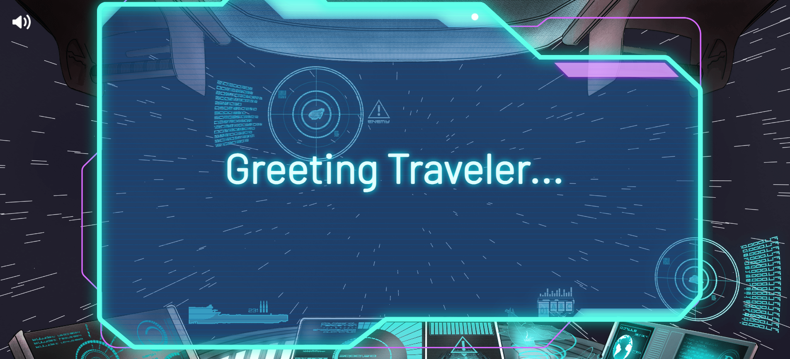
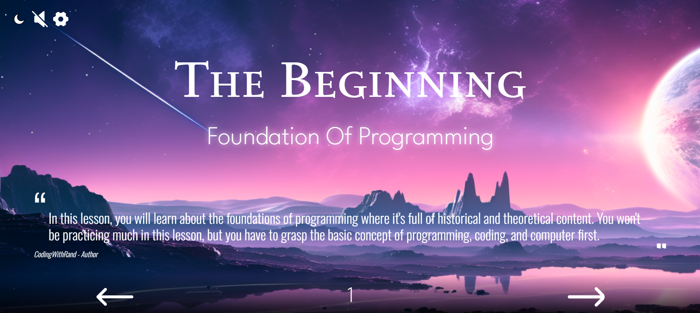
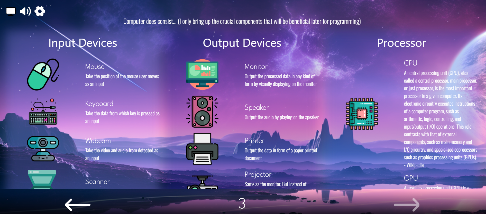
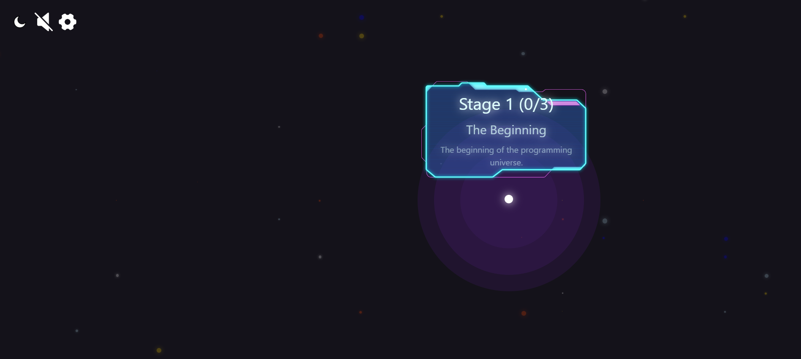

# CWR Education

Imagine of a space journey that you travel around in the universe, from galaxy to galaxy, to gather knowledge about... **_Coding & Programming_**

# Overview
This web application is the application where you can learn how to code and program from basic to advance. Also full with programming techniques and methods, and a unique and intriguing way of presentation.

It's a single page application (SPA), so it'd have a seamless transition between each page. There are a lot of animation playing such as the whooshing background and the moving texts, which are all CSS animation. You can also choose to turn on music or not as well.

This website is mainly developed on React and HTML, CSS, JavaScript. You can visit [here](https://cwr-education.vercel.app)

Currently, the project is still in the early build phase. There are still a lot more to go. Especially for the lesson which has just started the first unit Foundation of Programming and it still has three pages of content. I may also add the community section in the future too.
